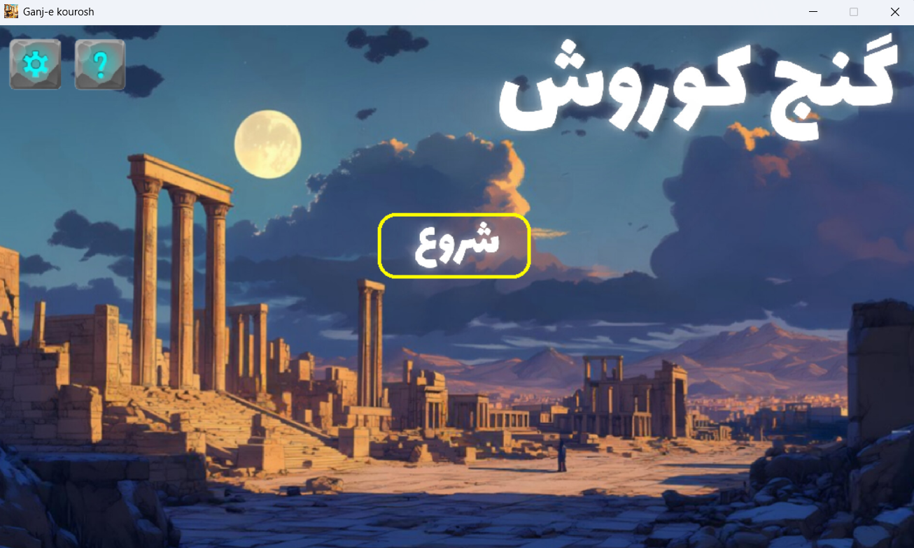
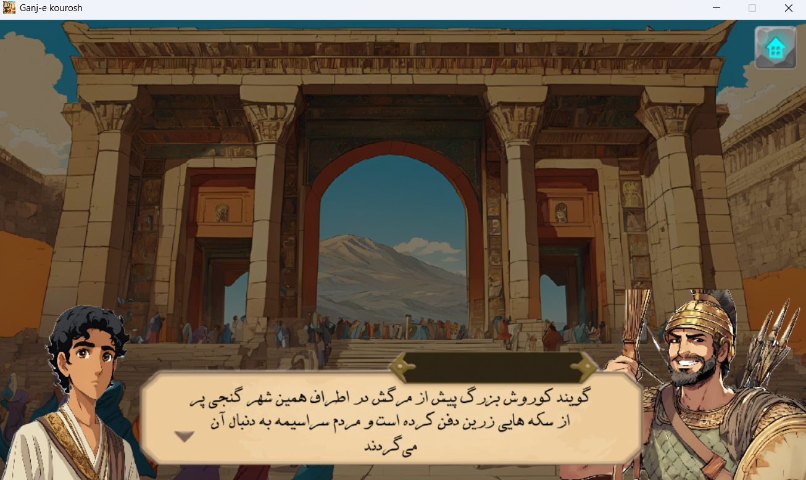

# Ganj-e Kourosh

**Ganj-e Kourosh** is a small game written in Python using **Pygame**.

The game is set during the **Achaemenid Empire** era and follows the journey of a man searching for the legendary treasure of **Cyrus the Great**.

---

## 📜 Story
In the age of the Achaemenids, when vast empires rose and fell, rumors spread of a great treasure left behind by **Cyrus the Great**.

You play as a lone adventurer who sets out on a dangerous journey to uncover this lost treasure.  
Along the way, you must survive, explore, and push forward in pursuit of glory and history.

---

## 🖼️ Screenshots





---

## ▶️ How to Run
Make sure you have **Python 3** installed, then install the required library and run the game:

```bash
pip install pygame
python Ganj-e_kourosh.py